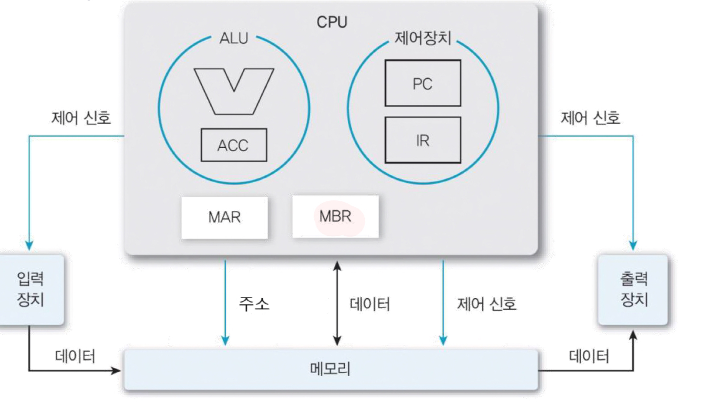

### CPU란?

CPU는 컴퓨터(서버)의 핵심 계산 장치이다. 컴퓨터 및 기타 스마트 장치는 데이터를 디지털 신호로 변환하고 이에 대한 수학적 연산을 수행한다. CPU는 이러한 신호를 처리하고 컴퓨팅을 가능하게 하며, 모든 컴퓨팅 장치의 두뇌 역할을 한다. 또한 운영체제 및 애플리케이션을 실행하는 데 필요한 모든 컴퓨팅 작업을 처리한다.

### CPU 구성요소

---

🔽 가삼컴퓨터 AccCom의 CPU 구성

 

1. 제어장치 ⇒ 명령어를 해석한 결과에 따라 약속된 제어신호를 만들어 낸다. 
**PC**(Program Counter) 레지스터 : 다음 번에 실행할 명령어 주소 보관 
**IR**(Instruction Register)레지스터 : 현재 실행 중인 명령어 보관

2. 연산장치 (ALU) 
**ACC**(Accumulator): 누산기 ⇒ 연산결과를 임시저장

3. 메모리 인터페이스 
**MAR(Memory Address Register)** : 메모리에 엑세스 할 때, 필요한 주소를 적는 곳 
**MBR(Memory Buffer Register)** : 메모리에 읽거나 쓰려는 데이터 혹은 명령을 일시적으로 보관하는 곳 
    ⇒ 아키텍쳐에 따라서 생략 가능 
    
 

>구성요소에 자세한 대한 정리는 [[컴퓨터의 구성]](https://www.notion.so/2bed00a4568e46bd830bdb4bcad8bb37?pvs=21)

### CPU 동작 원리

---

CPU는 다른 하드웨어 구성요소 및 소프트웨어 프로그램과 함께 동작하여 데이터를 처리하고 여러 장치 내의 정보 흐름을 관리한다. 어떻게 관리할까? 간단하게 말하자면, CPU는 메모리에서 명령어를 가져와서 필요한 작업을 수행하고 출력을 다시 메모리로 보낸다. 자세한 명령어 처리과정은 다음과 같다:

**명령어 처리 과정**

: CPU는 명령어를 처리할 때, 명령어를 읽어오는 인출 사이클과 명령어를 실행하는 실행 사이클을 반복한다.

1. **인출 사이클(Instruction Fetch Cycle, Fetch Cycle)** 
    
    : 실행할 명령어를 메모리에서 읽어 CPU로 가져오는 단계이다. 명령어는 CPU에 대한 특정 작업 또는 운영을 나타내는 이진 코드이다. 
    
    1. **PC 값 읽기** 

         PC에 저장된 명령어의 메모리 주소를 MAR로 보낸다. 현재 PC는 실행해야 할 명령어의 주소르르 가리키고 있다. 
        
    2. **MAT → 메모리 요청**
        
        MAR이 메모리에게 주소를 알려준다. 
        
    3. **제어신호가 메모리에게 읽기 신호(Read Signal)를 보낸다.**
    4. **메모리 데이터 전송**
        
        메모리는 요청된 주소에 있는 데이터(=명령어)를 읽고,  데이터 버스를 통해  MBR에 저장한다. 
        
    5. **MBR → IR저장**
        
        MBR에 저장된 명령어를 IR로 복사하여 저장한다.
        
    6. **PC 값을 갱신하여 다음 명령어 주소로 갱신한다.** 예) PC = PC + 2
 
 
2. **실행 사이클(Execution Cycle)** : IR에 저장된 명령어를 실행하는 단계이다. 명령어에 따라서 실행 과정이 다르다. 아래는 [LDA 310]를 실행하는 흐름이다. 해당 명령어는 주소 310의 데이터를 로드하라는 명령이다. 
    1. **IR해석**
        
        IR에 저장된 명령어[LDA 310]를 해석한다. 
        
    2. **MAR 갱신**
        
        명령어에 포함되어 있는 메모리주소(310)를 MAR에 저장(지정)한다.
        
    3. **제어신호가 읽기 신호 보낸다.**
    4. **데이터 로드**
        
        메모리는 해당 주소의 데이터를 읽어 MBR에 저장한다.
        
    5. **ACC 저장**
    6. **MBR에 저장한 데이터를 누산기(ACC)에 저장**한다. 해당 데이터는 이후 연산이나 결과 처리를 위해 데이터를 활용할 수 있다.  

>참조 https://aws.amazon.com/ko/what-is/cpu/