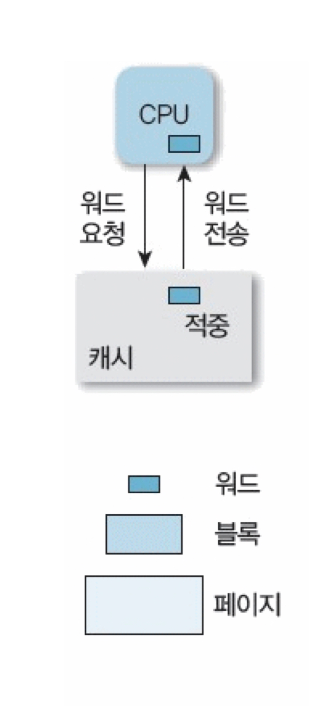
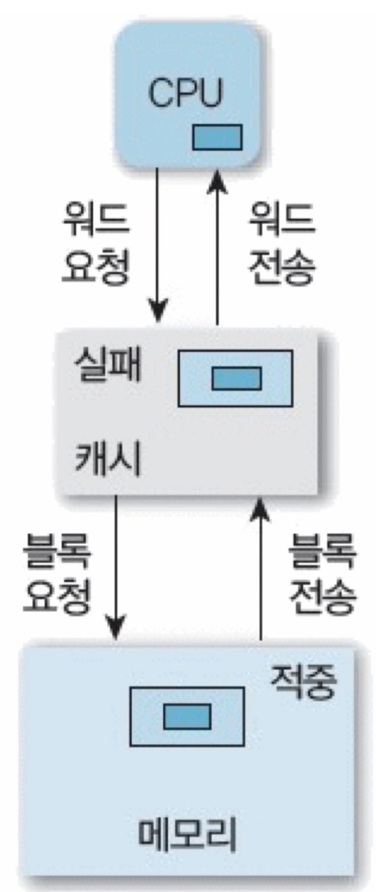
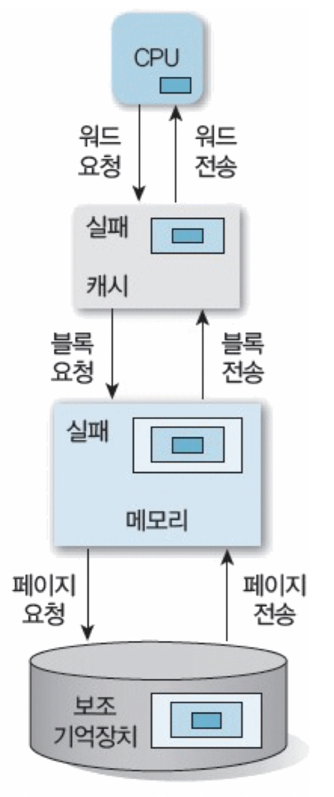

### 캐시 메모리(Cache Memory)

: CPU와 주 메모리 사이의 속도 차이를 줄이기 위해 CPU 내부 또는 CPU와 메모리 사이에 존재하는 고속 메모리이다. 자주 사용하는 데이터를 캐시 메모리에 저장하여 CPU가 데이터를 메모리에서 반복적으로 가져오는 과정을 줄인다. 

**투명성**

캐시 메모리는 하드웨어 수준에서 동작하기에 캐시 메모리의 존재 유무가 하드웨어 성능에는 큰 영향을 주지만, 프로그램의 논리적 결과에는 영향을 미치지 않는다. 즉, 프로그래머가 직접 제어하지 않아도 자동으로 관리된다.
<br/><br/>

**적중(hit)과 실패(fail)**<br />
캐시 메모리의 **성능을 평가**하는 중요한 개념이다.<br /><br />

&#10112; **캐시 적중** : 캐시 적중은 CPU가 요청한 데이터가 캐시 메모리에 존재하는 경우


<table>
  <tr>
    <td></td>
    <td>
      1. CPU가 특정 메모리 주소로 데이터를 요청.<br>
      ✔️ <strong>워드</strong> 연속되는 데이터의 일부분으로 CPU의 데이터 요청 단위.<br><br>
      2. <strong>캐시 조회</strong><br>
      ➡️ 캐시 메모리가 요청된 데이터(워드)를 가지고 있으면 = <strong>적중(hit)</strong>.<br><br>
      3. <strong>캐시 메모리 → CPU</strong><br>
      ➡️ 캐시 메모리는 데이터를 직접 CPU로 전송하여 메모리보다 빠르게 처리.
    </td>
  </tr>
</table>

&#10113; **캐시 실패 & 메모리 적중 (Cache Miss & Memory Hit)**

<table>
  <tr>
    <td></td>
    <td>
      1. <strong>캐시 조회</strong><br>
    ➡️ 캐시 메모리 해당 주소에 데이터 없다 = 실패 (fail)<br><br>
      2.<strong>  캐시 → 메모리</strong><br>
      ➡️ 캐시 메모리가 요청된 데이터(워드)를 가지고 있으면 = <strong>적중(hit)</strong>.<br><br>
      3. <strong>메모리 → 캐시</strong><br>
      ➡️ 캐시 메모리는 데이터를 직접 CPU로 전송하여 메모리보다 빠르게 처리.<br><br>
        4. <strong>캐시에 해당 블록 저장</strong><br><br>
     5. <strong>캐시 → CPU</strong><br>
      ➡️ CPU에게 워드 전달 
    </td>
  </tr>
</table>


&#10114; **캐시 실패 & 메모리 실패**<br>
메인 메모리 보다 훨씬 큰 메모리가 필요할 때 → 보조기억장치 사용

<table>
  <tr>
    <td></td>
    <td>
      1. <strong>캐시 조회</strong><br>
    ➡️ 캐시 메모리 해당 주소에 데이터 없다. = 캐시 실패 (fail)<br><br>
      2.<strong>  캐시 → 메모리</strong><br>
      ➡️         메인 메모리 주소에도 데이터 없다. = 메모리 실패(fail)<br><br>
      <strong>🚨 페이지 폴트 발생(OS개입)</strong><br>
      OS가 개입하여 보조기억장치(HDD/SSD)에서 데이터를 페이지 단위로 메모리에 복사.<br><br>
      3. <strong>보조기억장치 → 메모리</strong><br>
      ➡️ 필요한 데이터를 페이지(page)단위로 읽어와 메인 메모리에 저장<br><br>
        4. <strong>메모리 → 캐시메모리</strong><br>
        ➡️ <strong>CPU가 요청한 데이터를 포함한 블록만</strong>캐시 메모리로 전송<br><br>
     5. <strong>캐시메모리 → CPU  </strong> : CPU에게 워드 전달 
    </td>
  </tr>
</table>
    

**캐시 성능 평가: 적중률과 실패율**
- 캐시 적중률(Hit Rate):
요청한 데이터가 캐시에 있는 비율
    ```
    적중률(%) = (캐시 적중 횟수 / 전체 요청 횟수) × 100
    ```
- 캐시 실패율(Miss Rate):
요청한 데이터가 캐시에 없는 비율
    ```
    실패율(%) = 100 - 적중률(%)
    ```

    
### **브라우저 캐시**

브라우저 캐시는 “캐시”라는 개념의 웹 구현이라고 볼 수 있다. 캐시 메모리가 하드웨어 수준에서 CPU 성능 최적화를 위해 사용되는 것이라면, 브라우저 캐시는 소프트웨어적으로 웹 환경의 성능을 최적화 하기 위해 설계된 캐시의 한 종류이다. 

브라우저 캐시는 웹 페이지를 로드할 때 자주 사용되는 데이터를 사용자의 로컬 디스크나 메모리에 저장되어, 웹 요청과 응답 사이의 속도를 최적화하는 역할을 한다. 

동일한 리소스 (이미지, css파일, js 등)를 다시 요청할 경우, 서버로부터 다운로드 하지 않고 로컬 디스크에 저장된 캐시를 사용한다. 예를 들어, 웹 페이지 로드 시 반복되는 이미지나 css가 브라우저 캐시에 저장되어 빠르게 표시된다. 

#### 브라우저 캐시 동작 방식

- 처음 접속 시
    
    브라우저는 서버에서 이미지, CSS 파일, 자바스크립트(JS) 파일 등 페이지를 구성하는 다양한 리소스를 다운로드하여 사용자의 화면에 웹 페이지를 표시한다. 
    
    동시에 이 리소스들을 **로컬 저장소(브라우저 캐시)에 저장한다.** 캐시는 브라우저에 따라 다르게 저장됩니다.
    
    - Chrome: `chrome://cache/`
    - Firefox: `about:cache`
    
    **저장 용량과 유지 기간**
    
    - 브라우저는 캐시에 저장 가능한 데이터 용량을 제한하고, 오래된 데이터는 자동으로 삭제되거나, 유효 기간이 끝난 후에 삭제한다. 예를 들어 사이트 로고 이미지를 업데이트했다면, 기존의 캐시된 이미지는 새 로고 이미지로 교체된다.
    <br><br>
- 다음 접속 시
    
    동일한 리소스를 서버에 요청하기 전에, 로컬 캐시에 저장된 리소스가 유효한지 확인한다.
    
    유효하다면, 로컬에 저장된 데이터를 사용하여 더 빠르게 웹페이지를 로드한다.
    
    유료하지 않다면, 해당 리소스들을 서버에서 다시 다운로드하고 캐시를 업데이트 한다. <br><br>
    
    **유효한지 유효하지 않은 리소스인지 어떻게 판단하나?**
    
    브라우저는 캐시된 리소스의 유효성을 확인하기 위해서 서버와 통신하며 HTTP 헤더나 파일 메타 데이터를 활용한다. 이를 통해 리소스가 최신 버전인지 아닌지를 판단한다. <br><br>
    
    **HTTP 캐시 메커니즘 :** 
    
    HTTP의 캐시 제어 헤더를 사용하여 변경 여부를 확인한다. 주요 헤더는 다음과 같다. 
<br><br>

1. **Cache-Control**
    
    서버가 클라이언트(브라우저)에게 리소스의 캐시 정책을 전달한다. 예를 들어 리소스의 유효 기간을 설정한다.
    
    ```jsx
    Cache-Control : max-age=86400
    ```
    
    이 리소스는 24시간 동안 캐시할 수 있음을 의미하는 헤더 정보이다. 즉, 브라우저는 24시 동안은 서버로 확인 요청을 보내지 않고, 로컬 캐시를 사용한다.
    <br><br>

2. **ETag(Entity Tag)**
    
    리소스의 고유 식별자이다. 서버는 리소스의 내용을 기준으로 고유한 해시 값을 생성하여 ETag로 설정한다. 리소스가 번경되면 ETag 값도 변경된다. 
    
    동작 방식:
    
    1. 첫 번째 요청
        
        브라우저가 리소스를 요청하면, 서버는 리소스를 반환하면서  ETag값을 생성하고 응답 헤더에 포함하여 보낸다. 
        
    
        ```jsx
        HTTP/1.1 200 OK
        ETag: "xyz123"
        Content-Type: text/css
        ```
    
    2. 두 번째 요청
        
        브라우저는 ETag 값을 저장하고, 다음 요청 시, 브라우저는 “If-None-Match” 헤더에 저장된 ETag 값을 포함하여 요청을 보낸다. 
        
        ```jsx
        GET /styles.css HTTP/1.1
        If-None-Match: "xyz123"
        ```
        
    3. 서버 응답
        
        **서버는 클라이언트에서 보낸 ETag 값과 현재 리소스의 ETag 값을 비교한다.**
        
        - 일치한 경우 : “304 Not Modified”응답을 반환해준다. → 브라우저는 기존 캐시 사용
        - 불일치한 경우 : 새로운 리소스와 변경된 **ETag 값을 전송한다.**
        <br><br>
3. **Last-Modified**
    
    리소스가 마지막으로 수정된 시간을 나타낸다. 
    
    동작 방식 :
    
    1. 첫 번째 요청 시
        
        브라우저가 처음 리소스를 요청할 때, Last-Modified 값을 저장한다.
        
    2. 다음 요청 시
        
        If-Modified-Since 헤더에 저장된 시간을 서버로 보낸다.
        
    3. 서버 응답
        
        서버는 리소스의 수정 시간과 클라이언트가 보낸 If-Modified-Since 값을 비교한다.
        
        - 수정 시간이 더 이르면 : “200 OK”와 함께 새 리소스를 반환한다.
        - 수정 시간이 같거나 더 늦으면 :  “304 Not Modified”응답을 반환해준다. → 브라우저는 기존 캐시 사용한다.
