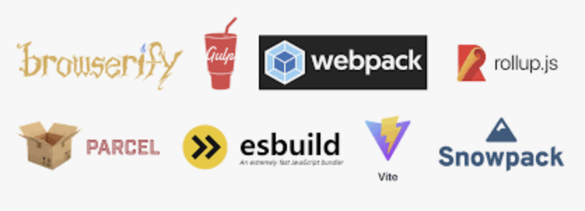
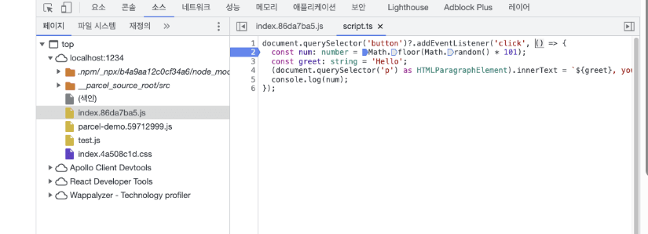
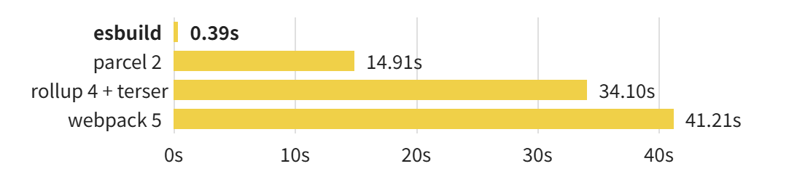
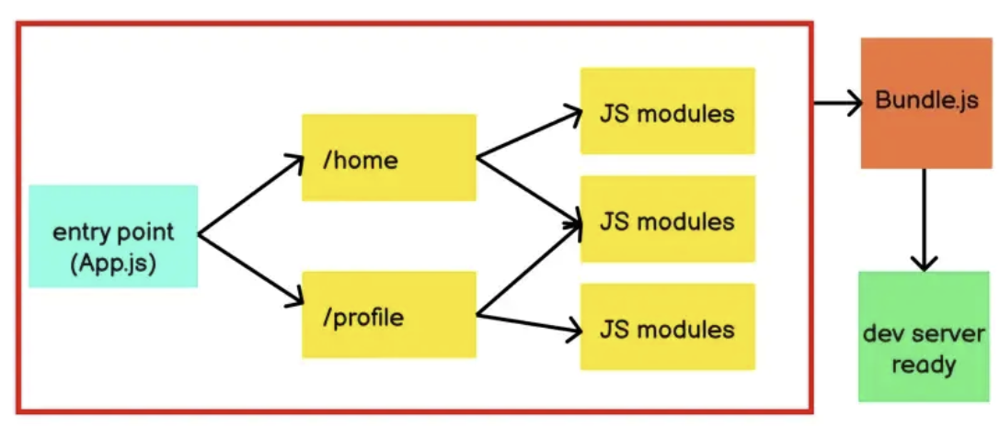

# Bundle? Bundler? 빌드 과정의 첫걸음

### 들어가기전

프로그램 개발하면서 번들링, 번들러라는 단어를 많이 들어봤다. 하지만 정확하게 어떤 것인지? 어떤 역할을 하는지?제대로 알고 사용하지는 못했다. 이번 기회에 제대로 파보기로 했다. 

---

### 그래서, 번들링을 왜 하는 걸까?

- 네트워크 요청 줄이기 위해서이다.
    
    과거에는 브라우저가 서버에 파일을 요청할 때, 한 번에 보낼 수 있는 요청의 수가 제한되어 있었다. 예를 들어서 10개의 JavaScript 파일이 있다면, 브라우저는 서버에 10번을 따로 요청해서 파일을 하나씩 받아와야 했다. 그러다 보니 각 요청마다 연결을 맺고 끊는과정이 반복되면서 시간 지연이 발생했다.
    
    이에 여러 개의 파일을 하나의 파일로 묶어 한번의 요청만으로 모든 코드를 받아오도록 했다. 이렇게 하면 네트워크 요청횟수가 줄어들어 초기 로딩 속도가 매우 빨라진다. 
    
    최근에는 HTTP2라고 하는 기술에서 여러 파일을 동시에 요청하는 방식을 사용한다고 한다.  
    
- 코드를 최적화하기 위해서이다.
    
    여러 개의 파일들을 합치는 과정에서 코드의 불필요한 공백, 주석 등을 제거하고(압축, Minification), 변수 이름을 짧게 바꾸는 등(난독화, Uglification) 파일 크기 자체를 줄여 브라우저에서 파일을 다운로드 속도를 높이기 위해서이다. 
    
- 브라우저 호환성을 높이기 위해서 이다.
    
    최신 JavaScript의 `import`, `export` 같은 모듈 시스템은 일부 구형 브라우저에서 바로 동작하지 않는다. 따라서 번들링 과정에서 이런 코드를 구형 브라우저도 이해할 수 있는 형태로 변환해야 한다.
    

## 빌드 도구와 번들러


### 번들(Bundle)과 번들러(Bundler)는 뭔가?

번들러는 위에서 언급된 여러 빌드 작업 중에서도 특히 **'(모듈)번들링'에 특화된 도구이다.** 번들러의 역할은 라이브러리나 웹 애플리케이션을 개발할 때, 여러 개의 파일에 흩어져 있는 코드(모듈)들(CSS, 이미자 파일, js파일)을 하나의 파일로 모아서 js파일로 만들어 브라우저가 이해할 수 있는 하나의 파일로 합치고 이를 넘겨주는 역할을 한다. 그리고 만들어낸 하나의 파일을 번들(`bundle.js`)이라고 한다. 

### 빌드 도구란?

번들러를 포함하는 더 큰 개념이다. 우리가 웹 애플리케이션을 만들면, build라는 과정을 거친다. 이 여러 빌드 작업을 하는 도구가 빌드 도구이다. 

**역할**

- **번들링 (Bundling):** 여러 파일을 묶는 작업.
- **트랜스파일링 (Transpiling):** 최신 문법의 코드(TypeScript 등)를 구형 브라우저용 코드로 변환. (예: Babel)
- **테스트 실행 (Test Running):** 작성한 코드가 잘 동작하는지 자동으로 테스트. (예: Jest)
- **코드 검사 (Linting):** 코드 스타일이나 잠재적인 오류를 검사. (예: ESLint)
- **작업 실행기 (Task Runner):** 파일 복사, 삭제 등 정해진 단순 작업을 자동화. (예: Gulp, Grunt)

<aside>
💡

오늘날에는 번들러가 단순히 파일만 합치는 것을 넘어, 코드 변환(Transpiling), 개발 서버 실행, 코드 압축 등 사실상 전체 빌드 과정 대부분을 책임지는 강력한 '빌드 도구'의 역할을 하고 있다. 그래서 빌드 도구를 번들러라고 혼용해서 사용하는 것 같다. 

</aside>

### 번들러는 구체적으로 어떤 일을 할까?

파일을 하나로 합치는 과정에서 여러가지 작업들을 수행한다. 

1. **Minification :** 주석제거 등 불필요한 코드를 줄여서 번들 사이즈 줄인다.
2. **Source Map (소스맵)** 

minification을 거치면 코드는 한 줄로 합쳐지고, 변수명도 a,b,c처럼 바뀌어서 사람이 해석할 수 없게 된다. 에러가 발생하면 “1번째 줄 58,294번째 글자에서 에러 발생”처럼 알려주기 때문에 디버깅이 불가능에 가깝다. 이걸 소스맵으로 해결한다. 번들러는 코드를 압축하면서, 압축된 코드의 특정 위치가 원본 코드의 몇 번째 줄에 해당하는지를 기록한 '지도' 파일(`.js.map`)을 함께 생성한다.<br/><br/>
개발자가 브라우저의 개발자 도구(F12)를 열면, 브라우저는 이 소스맵 파일을 참고하여 우리에게는 압축된 코드가 아닌 **익숙한 원본 코드를 보여준다.** 덕분에 우리는 압축된 버전으로 실행하면서도 디버깅은 원본 코드로 편리하게 할 수 있다.

1. **Loaders (로더)**
    
    기본적으로 번들러는 JavaScript 파일과 `import`/`export` 구문만 이해할 수 있다. 그래서 JavaScript 파일 안에서 아래와 같은 코드를 만나면 에러를 발생시킨다. 
    
    ```jsx
    import './styles.css'; // ? CSS 파일을 어떻게 가져오지?
    import logo from './logo.png'; // ? 이미지 파일은 또 어떻게 처리하지?
    ```
    
    이에 로더가 번들러가 JavaScript가 아닌 다른 종류의 파일들(CSS, 이미지, CSV) 을 만났을 때, 어떻게 처리해야 하는지 알려주는 역할을 한다. 
    
    - `css-loader`: CSS 파일을 읽어서 JavaScript가 이해할 수 있는 내용으로 변환합니다.
    - `file-loader`: 이미지나 폰트 파일을 읽어서 빌드 폴더로 옮기고, 그 경로를 알려줍니다.
    - `babel-loader`: 최신 JavaScript 코드를 Babel(트랜스파일러)을 이용해 구형 코드로 변환하는 작업을 연결해 줍니다.
    
    즉, 로더 덕분에 우리는 모든 자료(자원)를 JavaScript 모듈처럼 가져와서 사용할 수 있다.
    
2. **트리 쉐이킹 (Tree Shaking)** 
    
    `import`/`export` 관계를 분석해서, 우리 코드에서 **실제로 사용되지 않은 코드는 최종 번들에서 제외**시키는 최적화 기술이다. 이를 통해 불필요한 코드를 제거하여 최종 번들 크기를 크게 줄인다. 
    
3.  **코드 분할 (Code Splitting)**
모든 코드를 `bundle.js`라는 하나의 거대한 파일로 만들면, 사용자는 웹사이트에 처음 접속할 때 당장 필요 없는 코드까지 전부 다운로드해야 해서 초기 로딩 속도가 느려진다. 그래서 bundle.js 번들 파일을 **여러 개의 작은 '청크(chunk)' 파일로 나눈다.** 
    - **페이지별 분할:** 사용자가 A 페이지에 접속하면 A 페이지에 필요한 코드만 먼저 로드하고, B 페이지로 이동할 때 B 페이지 코드를 추가로 로드한다.
    - **공통 모듈 분할:** 여러 페이지에서 공통으로 사용되는 라이브러리(React 등)는 별도의 파일로 분리한다.
4. **개발 서버와 실시간 업데이트**
    
    말 그대로 **'개발할 때만 사용하는 임시 로컬 웹 서버'이다.** `npm run dev` 같은 명령어를 실행하면 우리 컴퓨터(보통 `localhost:5173` 같은 주소)에서 실행한다.
    
    이 서버의 가장 중요한 역할은 두 가지이다.
    
    1. **파일 서빙:** 웹 브라우저가 프로젝트 파일을 요청하면 알맞게 변환하여 보내준다.
    2. **파일 변경 감지 (File Watching):** 개발자가 프로젝트 내의 파일을 수정하고 저장하는지 항상 지켜본다.
    
    전통적인 방식에서는 코드를 수정하고, 직접 빌드 명령어를 실행한 뒤, 브라우저에서 새로고침(F5)을 해야 변경 내용을 확인할 수 있었다. 개발 서버는 이 모든 과정을 자동화하여 개발의 피로를 크게 줄여준다.
    
    **변경 사항이 브라우저에 반영되는 방식**
    
    - 라이브 리로드
        1. 개발자가 `MyComponent.js` 파일을 수정하고 저장합니다.
        2. 개발 서버가 파일 변경을 감지합니다.
        3. 개발 서버가 브라우저에게 "페이지 전체를 새로고침해!"라는 명령을 보냅니다.
        4. 브라우저는 페이지 전체를 새로고침(F5)합니다.
        
        **단점:**  페이지가 통째로 새로고침되기 때문에 기존의 모든 상태가 사라진다. 예를 들어, 팝업(모달)을 띄우고 그 안의 버튼 스타일을 수정했다면, 새로고침 후 다시 팝업을 띄우는 과정부터 반복해야 한다.
        
    - **HMR (Dev Server & HMR)**
    페이지 전체를 새로고침하지 않고, **바뀐 모듈(파일)만 실시간으로 교체**하여 앱의 상태를 유지하면서 화면을 업데이트해준다.  Vite, Webpack Dev Server 등 대부분의 최신 도구들이 이 방식을 사용한다.
        
        **작동 원리 (vite기준)**
        
        1. **연결:** 개발 서버와 브라우저는 웹소켓(WebSocket)이라는 통로로 실시간 연결을 유지한다.
        2. **감지:** 개발자가 `MyButton.jsx` 컴포넌트의 CSS를 수정하고 저장한다.
        3. **전송:** 개발 서버는 **변경된 `MyButton.jsx` 코드만** 빠르게 빌드하여 브라우저로 전송한다.
        4. **교체:** 브라우저에서 대기하던 Vite 클라이언트 스크립트가 새로운 코드를 받아서, 기존에 렌더링 되어 있던 **`MyButton` 컴포넌트만 새로운 버전으로 교체한다.**
        
        **HMR의 핵심은 애플리케이션의 상태가 그대로 유지된다는 점이다.**
        
        예를 들어, 여러 단계를 거쳐야 열리는 팝업창 안의 버튼 색깔을 바꾸고 싶을 때,
        
        - **라이브 리로드:** 색을 바꿀 때마다 페이지가 새로고침되어 매번 팝업창을 다시 열어야 한다.
        - **HMR:** 팝업창이 **열린 상태 그대로** 버튼 색깔만 실시간으로 바뀌는 것을 보며 작업할 수 있다.
        
        ⇒ HMR은 코드를 수정한 결과를 즉시, 그리고 기존 작업 상태를 유지하면서 확인할 수 있게 해주므로 개발자가 훨씬 더 빠르고 직관적으로 UI를 개발하고 디버깅할 수 있도록 돕는다. 
        
    

### 번들링 과정

---

`import`와 `export` 같은 모듈 시스템 키워드를 이해해서, 어떤 파일이 어떤 파일을 필요로 하는지(의존성 트리)를 스스로 분석한다. 그리고 그 관계에 맞게 파일들을 똑똑하게 합치고 최적화하여 최종 결과물인 '번들'을 만들어낸다.

### 대표적인 번들러들

---

대표적으로 webpack, Rollup, esbuild, vite 등이 있다. 

**esbuild “ 초고속 빌드 도구”**



주목받고 있는 번들러 이다. 사이트에 따르면 기존 웹 빌드 도구 보다 10배 ~ 100배 빠르다고 한다. 이게 가능한 이유는 Go언어라는 네이티브 언어로로 만들어 졌기 때문이다

- JavaScript, CSS, TypeScript, JSX를 지원한다.
- 서드파티 라이브러리 의존도를 최소화하고 대부분의 기능을 직접 구현하여 불필요한 번들 크기 증가를 줄였다.
- 번들링 뿐만 아니라, 개발 서버, 최적화 등 전체 빌드 과정을 실행할 수 있다.

**Vite** 


Vite는 차세대 프론트엔드 도구로, 개발 경험(DX)을 극대화하는 데 초점을 맞췄다. 상황에 따라 최고의 도구를 전략적으로 조합해서 사용한다. 번들링 뿐만 아니라, 트랜스파일링, 개발 서버, 최적화 등 전체 빌드 과정을 실행할 수 있다.

1. **개발 서버에서는 번들링을 하지 않는다.** 
    
    `npm run dev`로 개발 서버를 실행하면, vite는
     TypeScript, JSX 같은 파일들을 **매우 빠르게 트랜스파일링만**한다. esbuild는 단일 파일을 변환하는 속도가 굉장히 빠르다. 브라우저가 요청하는 파일만 즉시 변환해주고, 네이티브 ES 모듈을 통해 브라우저에 직접 전달한다. 따라서 코드를 수정하고 저장했을 때 거의 즉각적으로 화면에 반영(HMR - Hot Module Replacement)하는 데 최적화되어 있다. 이 '노-번들(No-Bundle)' 방식이 Vite의 압도적인 개발 속도의 비결이다. 
    
2. **프로덕션 빌드에서는 Rollup을 사용한다.**
`npm run build`로 최종 결과물을 만들 때는 **Rollup**을 번들러로 사용한다. Rollup은 트리 쉐이킹 등 최종 코드 최적화에 강점이 있기 때문이다. 이때, 코드 변환 속도를 높이기 위해 Rollup 내부에서 **SWC**를 트랜스파일러로 사용하도록 설정할 수 있다.

**Webpack (웹팩)**


가장 오래된 번들러이다. JavaScript 모듈뿐만 아니라 CSS, 이미지, 폰트 등 웹 애플리케이션을 구성하는 모든 자원을 번들링하는 데 중점을 두었다.

거의 모든 종류의 파일을 처리할 수 있는 로더가 강점이다. 

- **장점:** 생태계가 매우 거대하고 안정적이어서 어떤 복잡한 요구사항이든 해결할 수 있는 레퍼런스와 플러그인이 존재한다. 거의 모든 종류의 파일을 처리할 수 있는 강력한 로더(Loader)와 플러그인(Plugin) 시스템이 최대 강점이다.

<aside>
💡

플러그인 시스템이 잘 되어 있다는 말은 무슨 의미일까

사용자들이 겪을 수 있는 거의 모든 문제에 대한 해결책이 플러그인 형태로 이미 존재한다는 의미이다. **예를 들어,**

- "빌드가 끝난 후 결과물을 자동으로 FTP 서버에 올리고 싶은데..." → **관련 플러그인이 존재한다.**
- "번들 파일의 크기가 왜 이렇게 큰지 분석하는 리포트를 보고 싶은데..." → **관련 플러그인이 존재한다. (`webpack-bundle-analyzer`)**
- "특정 라이선스 주석을 모든 파일 상단에 자동으로 추가하고 싶은데..." → **관련 플러그인이 존재한다.**

이처럼 검증된 해결책을 가져와서 개발자들이 쉽게 문제를 해결할 수 있도록 이미 생태계가 형성되어 있다는 것이 Webpack의 강점이다.

</aside>

- **단점:** 기능이 많은 만큼 설정이 복잡하고, JavaScript 기반이라 다른 도구에 비해 빌드 속도가 상대적으로 느리다.

<aside>
💡

컴파일 타임에 이미 기계어 번역이 모두 완료되는 네이티브 언어에 비해 JavaScript는 런타임에 인터프리터에 의해 기계어 번역이 되는 스크립트 언어이다. 따라서 런타임에 번역 작업을 동반하면서 발생하는 오버헤드로 인해 상대적으로 느리다. 

</aside>

- **주요 용도:** 복잡하고 큰 규모의 **애플리케이션** 빌드에 적합합니다.

<aside>
💡

**큰 규모의 애플리케이션 빌드에 상대적으로 빌드 속도가 느린 웹팩이 적합한 이유는 뭘까?**

중요한 대규모 서비스일수록 이런 '안정성'은 속도보다 더 중요한 가치가 될 수 있다.

프로젝트를 진행하다 보면 "우리 회사에서만 쓰는 특수한 이미지 포맷을 처리해야 해", "아주 오래된 기업용 브라우저를 지원해야 해" 같은 특이하고 복잡한 요구사항이 생길 수 있다. 이런 특수한 상황을 위한 기능(플러그인)이 없을 가능성이 높고, 직접 만들어야 할 수 도 있다. 

웹팩은 수많은 플러그인과 로더들이 오랜 기간 동안 전 세계 수백만 개의 프로젝트에서 사용되었다. 오랜 기간 수많은 프로젝트에서 사용되었다는 것은 해당 도구와 주요 플러그인들이 다양한 환경과 극단적인 케이스(edge cases)에서 테스트되었음을 의미한다. 그래서 복잡하고 예측 불가능한 요구사항이 많은 대규모 프로젝트에 적합할 수 있다.

또한 설정이 복잡하다는 얘기는 **빌드 과정 하나하나를 회사에 맞게 완벽하게 제어할 수 있다**는 뜻이다. "A 종류의 파일은 이렇게, B 종류의 파일은 저렇게 특별 처리해줘" 와 같은 아주 세밀한 설정이 가능하다. 대규모 프로젝트는 이런 특별한 규칙이 필요한 경우가 많다.

</aside>

**Rollup**

**JavaScript 라이브러리**를 만드는 데 특화된 번들러이다. ESM 포맷을 기준으로 만들어져서 최종 번들에 꼭 필요한 코드만 남기는 트리 쉐이킹을 효율적으로 수행하여 최소한의 결과물을 만드는데 강점이 있다. 그래서 결과물이 가볍고 라이브러리 배포에 최적화되어 있다. 

코드 분할이나 HMR과 같은 애플리케이션 개발에 필요한 기능은 약한 편이지만, 재사용 가능한 JavaScript 라이브러리나 패키지를 만들 때 주로 사용된다. React, Vue 같은 라이브러리 자체가 롤업으로 빌드가 된다. 

### 마치며
---

번들러는 코드를 최적화하고 브라우저 호환성을 높여 웹 애플리케이션의 성능을 개선하는 중요한 도구이다. 더 좋은 번들러라기보다는 각 번들러마다 고유한 특징과 장단점이 있으므로, 프로젝트의 규모와 목적에 맞게 적절한 번들러를 선택하는 것이 중요하다.