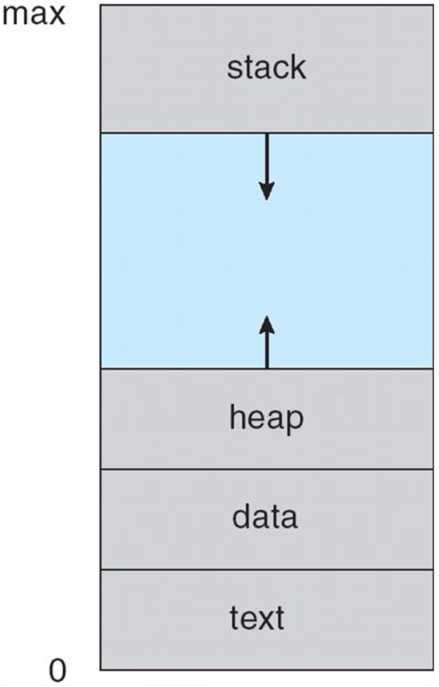
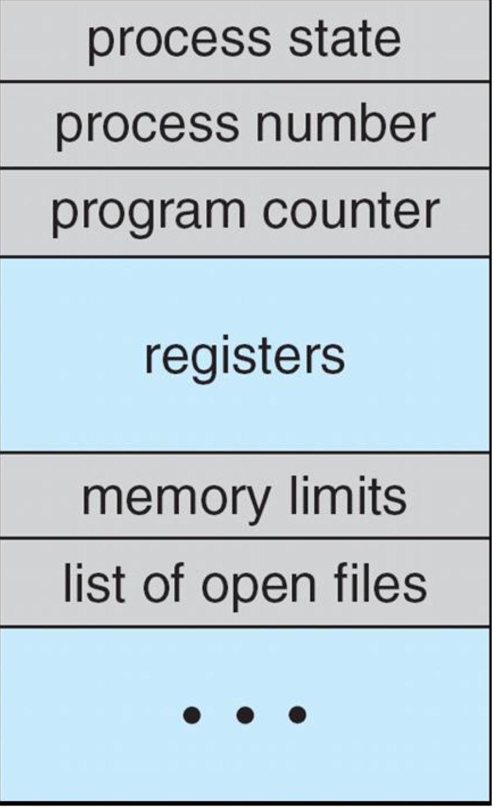
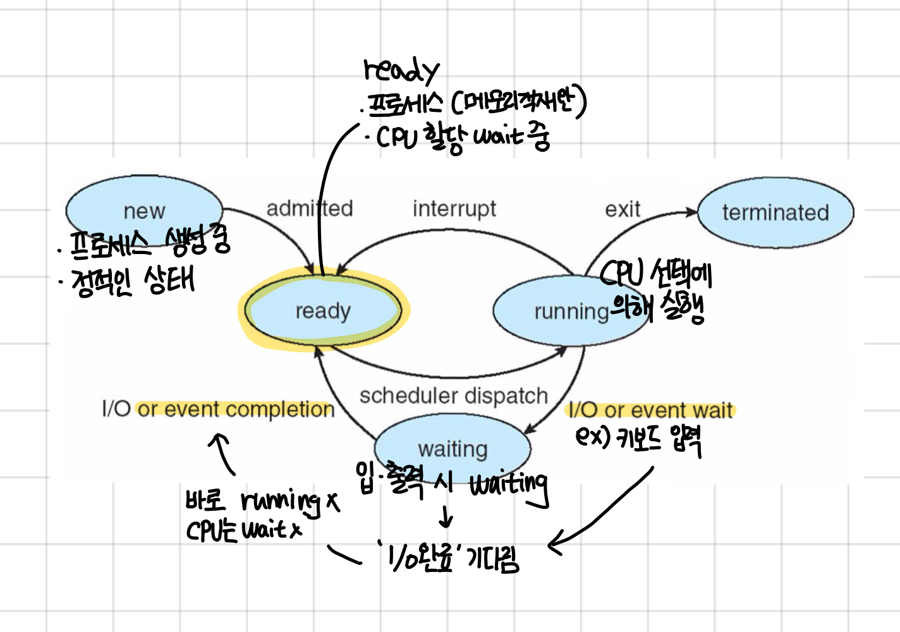
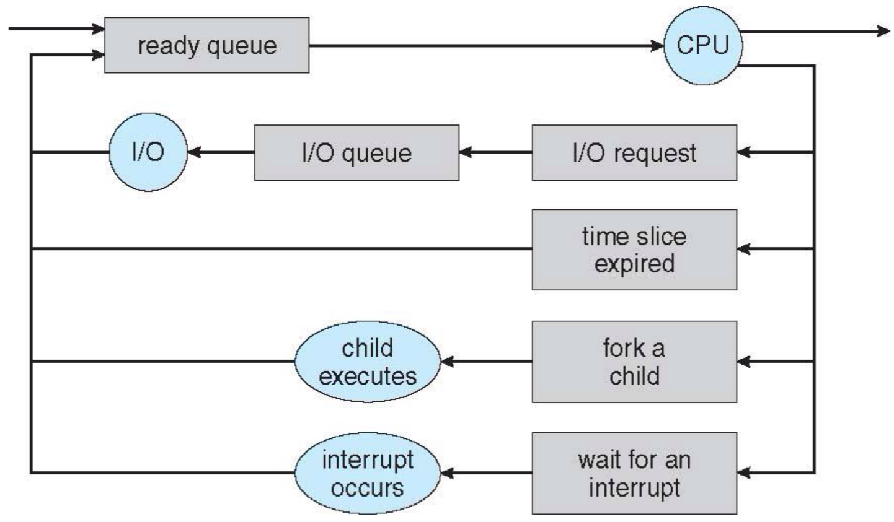
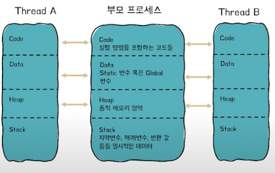
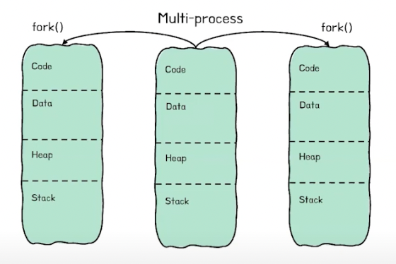

# 프로세스와 스레드

### 1. 프로세스
: 메모리에 적재되어 실행중인 프로그램(일, task)이다. 
각각의 프로세스는 독립된 메모리 공간을 가지며 , 다른 프로세스와 메모리 공간을 공유하지 않는다.

| 프로그램 | 보조기억장치(SSD, 하드디스크)에 존재하는 실행되기를 기다리는 명령(코드)과 정적인 데이터의 묶음, 쉽게 말하면 코드가 작성되어 있는 파일 |
| --- | --- |
| 프로세스 | 실행중인 프로그램  |
| 프로세서 | 명령어를 실행하는 장치 ex)CPU |

#### **프로그램이 프로세스가 되는 과정**
----
1️⃣ 메모리에 프로세스가 필요로 하는 **재료**들이 올라가야 한다. 
             
        [프로세스 메모리 구조]
        
- Stack 영역 [동적] 
    - 함수 호출과 관계되는 지역변수, 매개변수 등을 저장한다.
    - 함수 호출 시 생성되고 함수가 끝날 시에 반환한다.
- Heap 영역 [동적] 
    - 프로그램 실핼 중에 필요에 의해 메모리를 동적으로 할당하는 영역이다.
    - Heap에 할당된 메모리 블록은 프로그램이 직접 접근할 수 있는 변수 이름을 가지지 않는다.  예를 들어, **전역 변수**나 **지역 변수**처럼 특정 이름으로 직접 참조되지 않는다. 따라서 **Heap 메모리에 접근**하기 위해서는 **해당 메모리의 주소 값**이 필요하다. 주소 값에 의해서만 참조되고 사용되는 영역이다.
- Data 영역 
    - 프로그램의 실행과 종료 과정에서 발생한 전역변수와 static 변수, 배열 등을 저장한다.
        
        | BSS(Block Started by Symbol) 영역 | **초기화되지 않은 전역 변수**와 **static 변수**가 저장 `int a`; | 프로그램이 시작될 때 자동으로 0으로 초기화 된다.  | RAM에 저장 | - |
        | --- | --- | --- | --- | --- |
        | GVAR 영역 | **초기화된 전역 변수**와 **static 변수** `int a = 10;` | 프로그램 시작 시 초기 값이 필요하기 때문에 초기 값을 ROM에 저장하고 실행중에는 RAM에 로드된다.  | ROM에 저장 | 초기 값을 기록해야 되므로 BSS보다 상대적으로 큰 공간을 차지한다. |

        📌 **BSS와 GVAR(Data) 구분의 이유**
        
         **메모리 파일 크기의 효율성 때문이다.** BSS 영역은 초기화 되지 않은 변수를 0으로 초기화 할 뿐 이기에 ROM에 저장되지 않고, 실행시점에 RAM에 메모리만 할당해주면 된다. 
        
         반면, GVAR 영역은 초기 값을 기록해야 하기에 ROM에 저장하고, 프로그램이 실행될 때 RAM에 로드해야 한다. 여기서 초기화 되지 않은 데이터 까지 모두 ROM에 저장한다면, 프로그램의 크기가 커질 것이다. 
        
- Text/Code 영역
    - 실행 명령을 포함하는 코드들이 들어가는 부분으로 컴파일한 프로그램(기계어)가 저장된다.
    - 읽기 전용이다 .
  

2️⃣ 해당 프로세스에 대한 정보를 담고 있는 **PCB블럭이 프로세스 생성 시 함께 만들어진다.**
        
#### **프로세스 제어 블록(PCB, Process Control Block)** 
---
운영체제는 프로세스를 관리하기 위해 모든 프로세스의 중요한 정보를 PCB에 가지고 있다. 
             
        [PCB에 담기는 주요 정보]
        
1. 프로세스 정보
    - pid : **(Process ID :** 프로세스 고유 식별자.
    - 상태정보 : `new`, `ready`, `running`, `waiting`, `terminated`
2. 레지스터 정보
    - CPU 내부의 데이터 저장 공간으로 CPU가 컨텍스트 스위칭을 할 때, 현재 실행 중이던 프로세스의 레지스터 값을 PCB에 저장한다. 다른 프로세스가 실행을 마치고 돌아올 때, PCB에 저장된 레지스터 값을 복원하여 중단된 시점 이후 부터 다시 작업을 이어갈 수 있도록 한다.
3. 메모리 관리 정보
    - 프로세스가 사용하는 **코드, 데이터, 힙, 스택 영역의 주소 정보**가 포함된다.
    - 운영체제는 이 정보를 통해서 프로세스가 사용하는 메모리 영역을 추적하고 관리한다.
4. 입출력 정보 및 파일 관리 정보
    - 해당 프로세스가 사용하는 파일 핸들이나 입출력 장치에 대한 정보이다.
    - 프로세스 종료 시, 이 정보를 이용해 프로세스가 사용하던 파일이나 자원을 정리한다.

#### 프로세스 상태
---
 

- New (생성 상태)
    - 프로그램이 실행을 요청하여 프로세스가 생성된 상태이다.
    - 운영체제는 이 생성된 프로세스를 ready 상태로 전환하기 위해서 메모리에 적재한다.
- Ready (준비 상태)
    - 메모리에 적재된 상태로, 프로세서의 할당을 기다리는 상태이다.
    - 여러 프로세스가 ready 상태에 있을 수 있고, 스케줄러가 어떤 프로세스에 CPU를 할당할 지 결정한다.
- **Running** (실행 상태)
    - 프로세서 할당을 받아 실제로 실행되는 상태이다.
    - CPU에서 명령어를 수행하며 계산 작업 등을 진행한다.
- **Waiting** (대기 상태)
    - 프로세스가 실행 도중 입출력(I/O) 작업을 하거나 특정 이벤트가 발생하면 waiting 상태로 전환되어 기다리는 상태이다.
    - 작업이 완료되면, 다시 ready상태로 가서 프로세서 할당을 기다린다.
- **Terminated** (종료 상태)
    - 프로세스의 작업이 모두 완료되거나, 강제로 중단되면 종료 상태가 된다.
    - 프로세스는 더 이상 CPU나 메모리를 사용하지 않고, **OS에 의해 자원이 해제된다.**

#### 프로세스 스케줄링
---
: CPU가 다음에 어느 프로세스를 실행할 지 결정하는 것으로 운영체제가 각 프로세스에 CPU 자원을 어떻게 할당할 것인지에 대한 것이다. 

프로세스 스케줄링은 프로세스 큐(process quene)를 이용해서 관리한다. 프로세스 큐에는:

- 준비 큐:  프로세스들이 대기하는 큐 
    - CPU 할당을 대기
    
- 실행 큐: CPU를 사용하고 있는 프로세스가 있는 곳 
    - 항상 1개
    
- 대기 큐: 특정 이벤트를 기다리거나 입출력 작업이 완료될 때까지 대기하는 프로세스들의 큐
    - 입출력 작업 요청 프로세스가 입출력 작업이 완료될 때 까지 여기서 대기한다.
    

 

> 새로운 프로세스 in → 준비 큐 대기 → CPU 할당 후 
> 
> - 입출력 요청 시 : 입출력 작업 진행 → 대기큐에서 대기 → 완료 후 준비 큐 대기
> - CPU할당 시간 만료 시 :  준비 큐 대기
> - 자식 프로세스 생성(fork)시 : 자식 프로세스 작업완료 대기 or 부모프로세스 작업 실행 → 준비 큐 대기
> - 인터럽트 발생 시 : 인터럽트 처리 → 준비 큐에서 CPU 할당 대기 

 

### 스레드(Thread) :  경량화된 프로세스
---

 

출처: [https://www.youtube.com/watch?v=1grtWKqTn50](https://www.youtube.com/watch?v=1grtWKqTn50)

**스레드란?**

---

: 하나의 프로세스 내에 실행되는 실행단위이다.

> **스레드는 경량화된 프로세스** 

스레드는 하나의 프로세스 안에서 여러 작업을 동시에 수행하기 위해 나뉜 **경량 프로세스(Lightweight Process)라고 볼 수 있다.** 
위 사진과 같이 하나의 프로세스 안에 다수의 스레드가 있을 때 공유되는 자원이 있기 때문이다. 여러 스레드는 프로세스의 메모리 구조 중에 code, data, heap 영역을 공통된 자원으로 사용하고, 각 스레드는 고유한 Stack을 가진다. 공유된 자원이 있기 때문에 컨텍스트 스위칭이 시 캐싱 적중률이 올라간다. 

**스레드 관리 방식과 성능 이슈**

---

**사용자 레벨 스레드 (User Thread)** 
- 애플리케이션 수준(응용프로그램 내부)에서 생성되고 관리되는 스레드이다.
    - 응용프로그램 라이브러리 호출로 스레드를 생성한다(`Pthreads` 등).

- 운영체제에 의해 인식되지 않는다. 즉, 해당 스레드가 실행 중인지 블록 상태인지 운영체제가 인지하지 못한다.
    - 만약, 사용자 레벨 스레드 블록 상태가 되면 운영체제는 사용자 레벨 스레드 개별적으로 인식하지 않으므로 전체 프로세스가 블록된 것으로 처리한다. 결과적으로 다른 스레드들이 실제로는 실행 가능한 상태임에도 불구하고 실행되지 않게 되고 이는 성능 저하를 가져올 수 있다.

**커널 레벨 스레드(Kernel Thread)**
- 운영체제의 커널에서 직접 생성되고 관리되는 스레드이다.
    - 응용프로그램은 시스템 콜로 커널 레벨 스레드 생성한다.

- 커널이 스레드의 생성, 스케줄링, 상태전환을 모두 관리한다.
    - 각 스레드의 상태를 커널이 인지하므로, 하나의 스레드가 블록 상태(블로킹)에 빠져도 다른 스레드는 계속 실행될 수 있다.  

**성능 저하 해결 방법**

---

- 문제점
    - **사용자 레벨 스레드**의 경우, 하나의 스레드가 블록되면 **전체 프로세스가 정지**하는 문제가 발생한다.
- 해결책
    - 하이브리드 스레드 : 사용자 레벨 스레드와 커널 레벨 스레드의 장점을 결합한 방식이다.
    - 커널에 의해 관리되는 커널 스레드 위에서 여러 사용자 스레드가 동작하는 방식이다.
    - 블로킹 문제를 완화하면서도 효율적인 스레드 관리가 가능하다.  

> **💡 스레드의 병렬성 향샹은 어떻게 할 수 있을까** 
>여러 작업을  동시에 수행하기 위해서 함수 단위로 스레드를 추가할 수 있다.
>- 함수 = 스레드 분할 단위
>- 스레드 분할 시점 = 새로운 함수가 실행되는 순간
>
 

**스레드의 생성, 종료, 및 조인 메커니즘**

---

**스레드 생성**

- 프로세스가 생성 → 운영체제에 의해 자동으로 main 스레드 생성
- 시스템 콜 혹은 라이브러리 함수를 호출하여 새로운 스레드 생성 가능

**스레드 종료**

- 스레드만 종료하는 함수 호출 시 해당 스레드만 종료한다. 예) pthread_exit()

**스레드 조인**

- 스레드가 다른 스레드가 종료할 때 까지 대기 → 이후에 join으로 만나게 만든다.
    - 주로 부모 스레드가 자식 스레드의 종료를 대기하는 경우이다.

 

→ 필요할 때 마다 스레드 생성과 종료 작업도 부하가 될 수 있기에 스레드를 무한정 만들어 사용할 수 없다. 그래서 나온 것이 스레드 풀이다. 
 

**스레드 풀**

---

스레드 풀은 미리 생성된 sub스레드의 그룹이다. 대기하고 있다가 요청을 받으면 스레드를 매니저가 깨워서 작업 처리한다.

👍🏻 **장점**
- 스레드 생성과 종료 작업에서 발생하는 부하가 줄어 성능 향상
- 스레드 새로 생성 하는 것 보다 빠름
- 스레드 수 제한 설정 가능
- 주기적인 작업 처리 시, 유연한 작업 진행 가능

 

### **컴퓨터 시스템의 병렬성**과 **동시 실행**
---
사용되는 단위(프로세스, 스레드 등)와 실행 방식에서 차이가 있다. 

1. **멀티 프로그래밍 (Multi-programming)** 
    
    : CPU가 최대한 쉬지 않고 계속 사용되도록 여러 프로그램이을 메모리에 모두 적재하여 여러 프로그램을 교대로 실행하는 방식이다.
    
    - 운영체제는 하나의 프로그램이 입출력 작업을 수행하는 동안 다른 프로그램에게 CPU를 할당한다.
    
2.  **멀티 태스킹(Multi-tasking)** 
    
    : 시분할 방식으로 한 CPU가 여러 프로세스를 짧은 시간 단위로 교대로 실행하여 마치 여러 작업이 동시에 수행되는 것처럼 보이도록 하는 것이다.
    
    - 프로세스 단위로 작업을 분할한다 .
    
3. **멀티 스레딩(Multi-threading)**<

    하나의 프로세스 내에서 여러 스레드가 동시에 실행되는 방식이다.
    
    - 실행단위는 프로세스일 수도 있고 스레드가 될 수도 있다. 만약 프로세스가 다수의 스레드로 구분되어 있다면 실행단위는 스레드가 되고, 그렇지 않다면 프로세스 그 자체가 된다. (해당 프로세스 내 단 하나의 스레드)
    - 예시
        - 게임 프로그램에서 다음과 같은 작업이 각각 스레드로 실행된다 :
            - 화면변경 :브라우저 창 움직이기 동시에 화면 내부 업데이트
            - 스펠링체크 : 문서 입력중 + 바로바로 빨간 줄 표시
            - 데이터통신 : 네트워크로 서버에서 데이터 가져오기 → 멀티스레드가 없다면 화면이 멈춤
            - 네트워크 응답
    
    - 스레드 끼리 공유된 자원을 가지고 있기에 긴밀하게 연결된 관계이다. 때문에 동기화 작업이 중요하고, 공유 자원 관리를 해주어야 한다. 하지만 메모리를 효율적으로 사용할 수 있고, 통신 비용이 절감된다.
    
4. **멀티 프로세싱(Multi-processing)**
    
    멀티코어 프로세서가 등장하면서 여러 코어를 활용해 병렬 처리 성능을 극대화 할 수 있는 방법으로 등장했다. 여러 CPU 또는 코어를 사용하여 단순히 여러 작업을 교대로 실행하는 것이 아니라, 실제로 동시에 여러 프로세스를 실행하는 방식이다. 

     
    
    
    
    - 독립적인 프로세스들이 동시에 여러 개를 실행하는 것으로 시스템 성능 높일 수 있다.
    - 각 프로세스는 독립적이고, IPC를 통해서 통신한다.
    - 독립적이기에 동기화 작업에 신경을 많이 쓰지 않아도 된다.
    - 개별적 메모리를 차지하기에 자원을 소모한다.
    - 컨텍스트 스위칭 비용이 크다.
    
    > **멀티코어 (Multi-core)**
    >
    >: 하나의 물리적 CPU 칩에 여러 개의 **코어(처리장치)**가 포함된 구조이다. 각 코어는 독립된 연산 유닛으로 서로 다른 작업을 병렬로 실행할 수 있다.
    >
    >- 멀티코어는 멀티프로세싱을 가능하게 하는 하드웨어 기술이다.
    >

